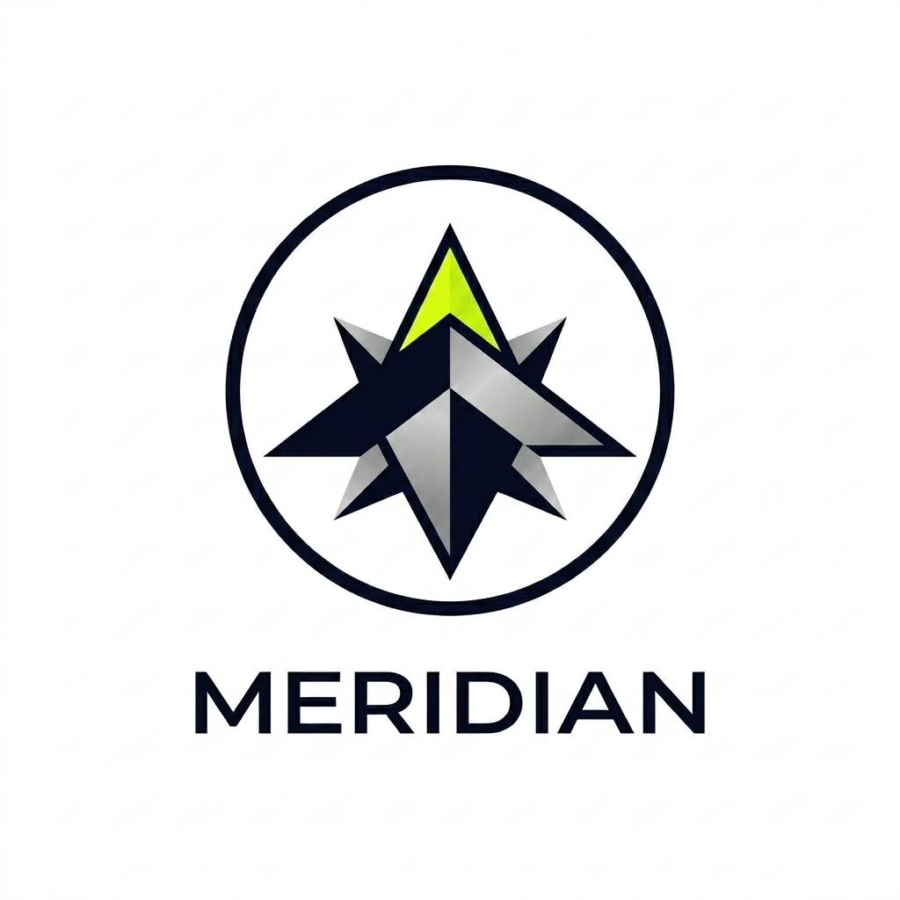

<div align="center">
  

  # 🌌 Meridian OS

  **Designs That Speak Louder Than Words**  
  *A high-performance architecture for localized intelligence processing.*

  [](#)
  [](#)
  [](#)
</div>

---

## 🚀 The End-Consumer Experience

Meridian OS is an **Agentic IDE** and **Personal CTO pipeline** designed for engineers who want to map market opportunities, design intelligent workflows, and synthesize breathtaking portfolios—all at lightning speed. 

It is tailored for modern developers seeking to bypass the noise:
- **Build Faster:** Go from ideation to deployment over a single weekend.
- **Stand Out:** Generate recruiter-ready showcases that command attention.
- **Ship Constantly:** Benefit from an onboard AI that acts as your senior technical architect.

> *"Meridian took me from application to offer in 6 weeks. The job matching alone saved me 40+ hours of manual searching."* — **Priya S.** (SWE → Senior at Stripe)

---

## 🧠 The Pipeline Matrix

Our platform runs on a rigorous 4-phase execution sequence:

| Phase | System | Description |
| :---: | :--- | :--- |
| **01** | `intelligence` | Market gap analysis utilizing vector memory to locate high-demand ecosystem opportunities. |
| **02** | `architect` | End-to-end blueprinting: functional scope, data schemas, and strict API mockups. |
| **03** | `build flow` | The localized Agentic IDE (Sandpack-powered) for scaffolding systems directly onto your edge nodes. |
| **04** | `synthesis` | Automated extraction outputting GitHub-ready readmes and matched portfolios. |

---

## ⚡ Core Features

- **Personal CTO Initialization Wizard**: An onboarding wizard with an immersive 3D background (Three.js/GLSL) that calibrates the agent's intelligence based on your professional DNA.
- **Agentic IDE Workspaces**: Powered by Sandpack and Cobalt2, you get a zero-friction, terminal-synced browser IDE to execute code while chatting directly with the AI architect.
- **Deployment Roadmaps**: Dynamic visualization of architectural system flows and database schemas ensuring robust design patterns before writing a single line.
- **Glassmorphism UI**: Intricate visual experiences utilizing `@gsap/react` and Framer Motion for premium, physics-based micro-interactions.

---

## 🛠️ Tech Stack Initialization

Meridian OS is built natively for the modern node:

- **Framework**: [Next.js](https://nextjs.org) (App Router)
- **UI & Transitions**: [TailwindCSS](https://tailwindcss.com/) + [Framer Motion](https://www.framer.com/motion/) + [GSAP](https://gsap.com/)
- **Visuals**: [Three.js](https://threejs.org/) + GLSL Shaders
- **In-Browser IDE**: [Sandpack](https://sandpack.codesandbox.io/) by CodeSandbox
- **Intelligence**: AWS Bedrock Runtime

---

## 🖥️ Local Execution

First, spin up the development ecosystem:

```bash
npm install
npm run dev
```

The localized execution interface will establish an uplink at [http://localhost:3000](http://localhost:3000).

---

<div align="center">
  <p className="text-xs font-light mt-0.5 tracking-wide text-indigo-400">
    <b>Built for the Modern Node.</b> <br/>
    Meridian Intelligence Corp. — Status: Nominal.
  </p>
</div>
